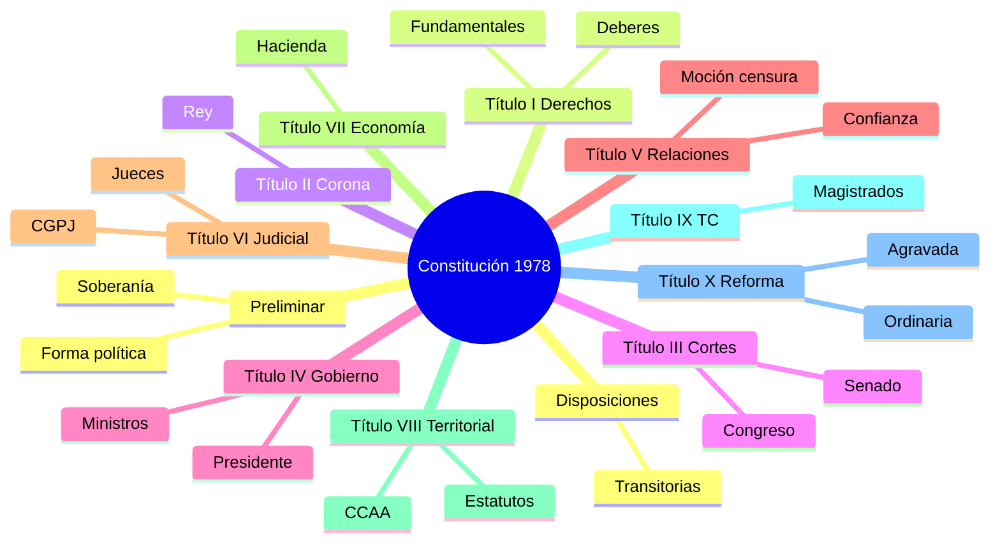

# Esquema: Organización del Estado

```mermaid
mindmap
  root((Constitución 1978))
    Preliminar
      Forma política
      Soberanía
    Título I Derechos
      Fundamentales
      Deberes
    Título II Corona
      Rey
    Título III Cortes
      Congreso
      Senado
    Título IV Gobierno
      Presidente
      Ministros
    Título V Relaciones
      Moción censura
      Confianza
    Título VI Judicial
      Jueces
      CGPJ
    Título VII Economía
      Hacienda
    Título VIII Territorial
      CCAA
      Estatutos
    Título IX TC
      Magistrados
    Título X Reforma
      Ordinaria
      Agravada
    Disposiciones
      Transitorias
```
