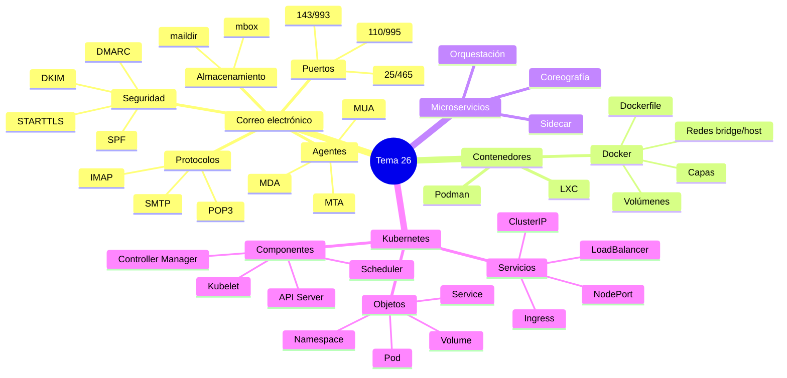

# Esquema: Mapa mental del Tema 26

```mermaid
mindmap
  root((Tema 26))
    Correo electrónico
      Protocolos
        SMTP
        POP3
        IMAP
      Puertos
        25/465
        110/995
        143/993
      Seguridad
        SPF
        DKIM
        DMARC
        STARTTLS
      Agentes
        MUA
        MTA
        MDA
      Almacenamiento
        mbox
        maildir
    Contenedores
      Docker
        Capas
        Dockerfile
        Volúmenes
        Redes bridge/host
      LXC
      Podman
    Microservicios
      Coreografía
      Orquestación
      Sidecar
    Kubernetes
      Objetos
        Pod
        Service
        Volume
        Namespace
      Componentes
        Kubelet
        API Server
        Scheduler
        Controller Manager
      Servicios
        ClusterIP
        NodePort
        LoadBalancer
        Ingress
```
file_path">
/root/oposicion/temario/tema-26-servidores-de-correo-contenedores-y-microservicios/02-esquemas/mindmap-tema.md